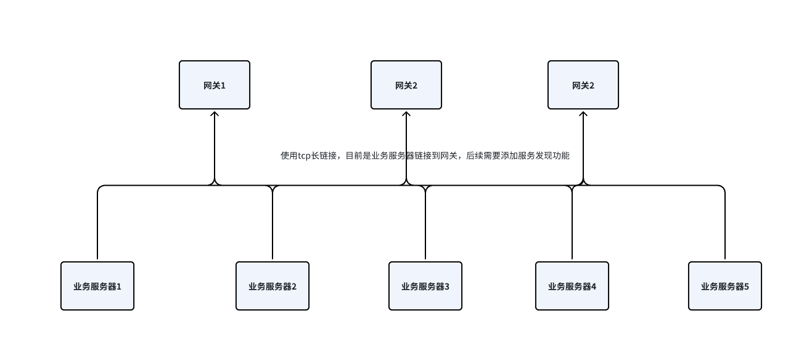
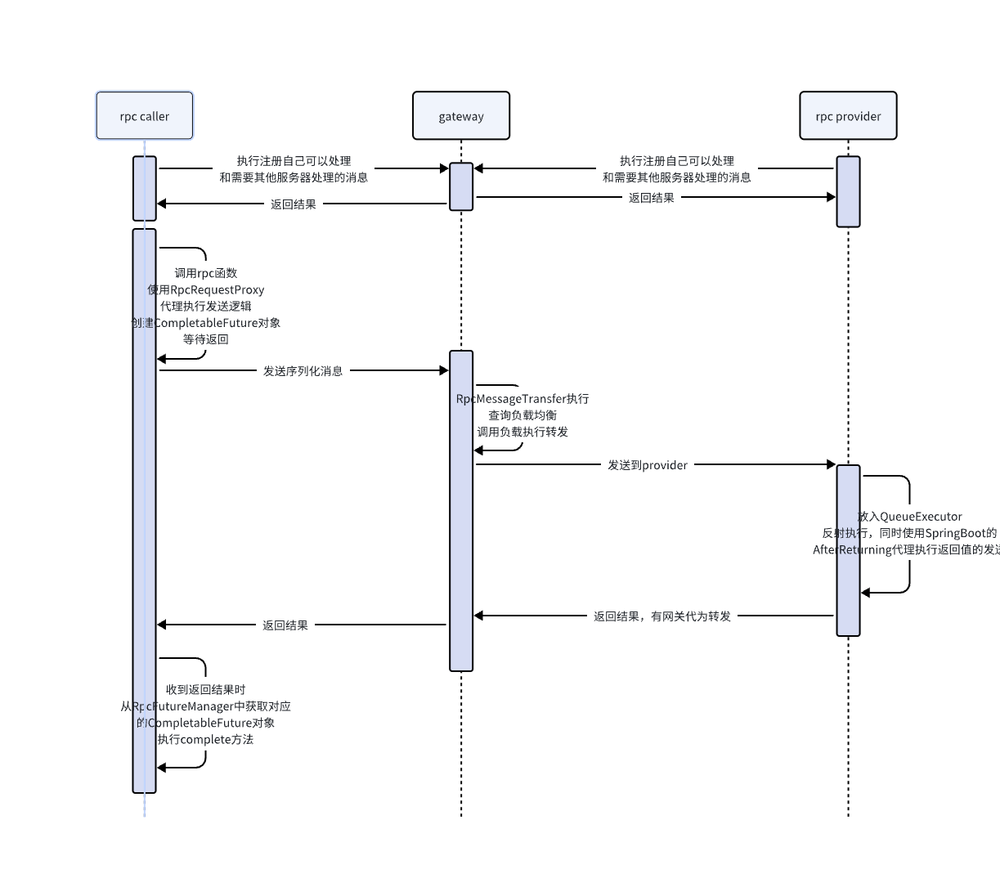

# 简述

    1. 使用netty进行长连接，提供java版本的rpc支持，支持同步和异步调用
    2. 实现了java的编解码器，支持基础类型、对象类型、map、set、list的编解码，兼容protobuf
    3. 提供无锁队列执行rpc消息处理
    4. 支持服务器同时为调用方和rpc提供方
    5. 提供网关功能，实现rpc消息的负载均衡

## 网络结构图

## rpc调用时序图

## 模块描述

### anno
    部分注解

### annoprocessor
    使用java的编译预前处理，扫描定义了Message注解的接口，生成消息id

### message
    消息定义和接口定义

### core
    rpc主要功能实现
    1. 实现java的编解码器，包名：com.tt.core.message
    2. 实现网络通讯，包名：com.tt.core.net
    3. 提供rpc消息代理，包名：com.tt.core.proxy
    4. 提供网关的负载均衡，目前仅支持一致性hash，包名：com.tt.core.gatelb
    5. 提供无锁队列和有序线程池，包名：com.tt.core.thread
    6. 实现消息注册，包名：com.tt.core.message

### gateway
    网关功能
    1. 提供消息转发
    2. 每个消息id都可以定义一个负载策略，具体查看com.tt.core.message.MessageManager类

### RpcTest
    测试

### RpcTest1
    测试1
    
